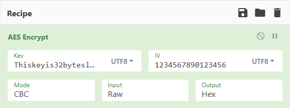
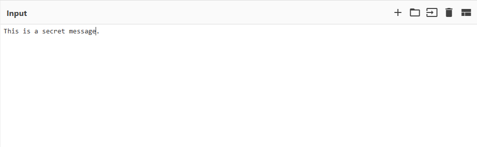
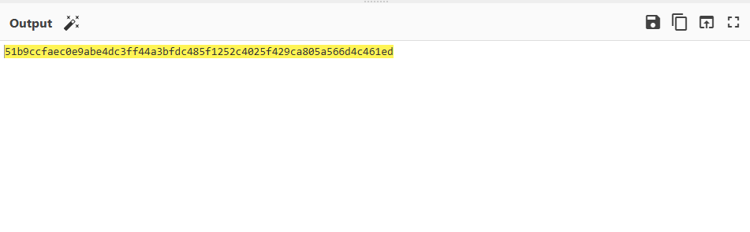

# AES-256-Cryptographic-Lab
A practical laboratory exercise implementing symmetric encryption using the AES-256 standard in CBC mode. This project demonstrates cryptographic troubleshooting, key/IV management, and block cipher analysis for SOC Analyst applications.
# Lab: Practical Implementation of AES-256 Symmetric Encryption
## Project Navigation

1. [Technical Lab Implementation](README.md) 

2. [Deep Dive: Technical Reflections](Technical_Reflections.md)

3. [Strategic View: Real-World Applications](Real_World_Applications.md)

## 1. Project Overview
This lab demonstrates the configuration and execution of the **Advanced Encryption Standard (AES)** in **Cipher Block Chaining (CBC)** mode. As an aspiring SOC Analyst, understanding how block ciphers transform data is critical for identifying encrypted traffic patterns and ensuring data confidentiality within the CIA Triad.

The exercise highlights the mathematical strictness of modern cryptography, specifically focusing on key lengths, initialization vectors (IVs), and the resolution of common configuration errors.

---

## 2. Technical Environment & Configuration
I utilized **CyberChef** to simulate a cryptographic engine. The parameters were set to meet the **AES-256** standard, which is the current industry gold standard for securing sensitive data.

| Component | Setting | Technical Description |
| :--- | :--- | :--- |
| **Algorithm** | AES | A symmetric-key block cipher with a 128-bit block size. |
| **Key** | `Thiskeyis32byteslongforaes256...` | A 256-bit (32-byte) key, providing 14 rounds of encryption. |
| **IV** | `1234567890123456` | A 128-bit (16-byte) value used to ensure unique ciphertext. |
| **Mode** | CBC | A mode that XORs each plaintext block with the previous ciphertext block. |
| **Padding** | PKCS#7 | Ensures data fits perfectly into 16-byte blocks by adding filler bytes. |

*Figure 1: CyberChef configuration showing the AES-256 parameters and UTF-8 input types.*

---

## 3. Troubleshooting & Cryptographic Constraints
One of the key takeaways from this lab was the "strictness" of key lengths. Cryptographic algorithms require exact bit-counts to function.

* **The Error:** Initially, the key length was incorrect (31 bytes), causing an "Invalid Key Length" error in the engine.
* **The Resolution:** I modified the key string to exactly **32 characters**, satisfying the 256-bit requirement for AES-256.
* **The IV Rule:** I confirmed that while the key length can vary (128, 192, or 256 bits), the **IV must always be 16 bytes**. This is because the IV is tied to the AES **Block Size** (128 bits), not the password length.

---

## 4. Execution Results

### Plaintext Input
The input represents the raw, unencrypted data (Plaintext) that requires protection.

*Figure 2: The raw message: "This is a secret message."*

### Ciphertext Output
The resulting ciphertext was rendered in **Hexadecimal** format for byte-level analysis.

*Figure 3: The 256-bit ciphertext: `51b9ccfaec0e9abe4dc3ff44a3bfdc485f1252c4025f429ca805a566d4c461ed`*

### Full Process Overview

*Figure 4: The complete workflow: Input (Plaintext) → Recipe (AES-256) → Output (Hex Ciphertext).*

---

## 5. Technical Analysis
* **Padding Implementation:** Since the input "This is a secret message." is 25 bytes, the algorithm utilized **7 bytes of PKCS#7 padding** to complete the second 16-byte block. This resulted in a total ciphertext length of 32 bytes (64 Hexadecimal characters).
* **Diffusion:** The Hex string shows no repeating characters, proving that **CBC Mode** successfully masked the underlying data structure.
* **Integrity Check:** I successfully reversed the process using the **AES Decrypt** function with the same Key and IV to recover the original message.

---

## 6. Conclusion
This lab successfully demonstrates the implementation of AES-256. For a SOC Analyst, recognizing these structures is vital when analyzing logs or packet captures to differentiate between standard encrypted traffic and potential data exfiltration.
